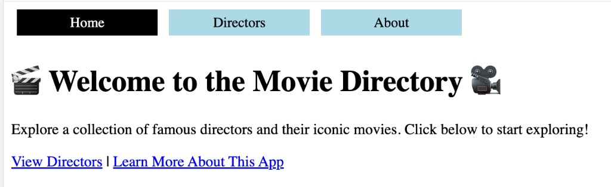

# Movie Directory

A React application for browsing film directors and their movies. Users can view director lists, open director and movie detail pages, and add new directors or movies — all with client-side routing so the page does not fully reload.

## Features

- Browse a list of directors at `/directors`
- Add a new director at `/directors/new` and land on that director’s page
- View a director’s bio and movies at `/directors/:id`
- Add a movie to a director and open the new movie’s detail page
- View movie duration and genres at `/directors/:id/movies/:movieId`
- Unknown URLs show a friendly error page

Routing is built with React Router v6. Nested routes share director data through `useOutletContext`, and forms use `useNavigate` after a successful submit.

## Screenshot

Home page with navigation to Directors and About:



## Getting Started

```bash
npm install
npm install react-router-dom@6
```

Start the API and the React app in two terminals:

```bash
npm run server
npm run dev
```

json-server runs on port 4000. The Vite app typically opens at `http://localhost:5173`.

## Routes

| Path | Page |
| --- | --- |
| `/` | Home |
| `/about` | About |
| `/directors` | Director list |
| `/directors/new` | Add director |
| `/directors/:id` | Director details |
| `/directors/:id/movies/new` | Add movie |
| `/directors/:id/movies/:movieId` | Movie details |
| `*` | Error page |

## Tests

```bash
npm run test
```
